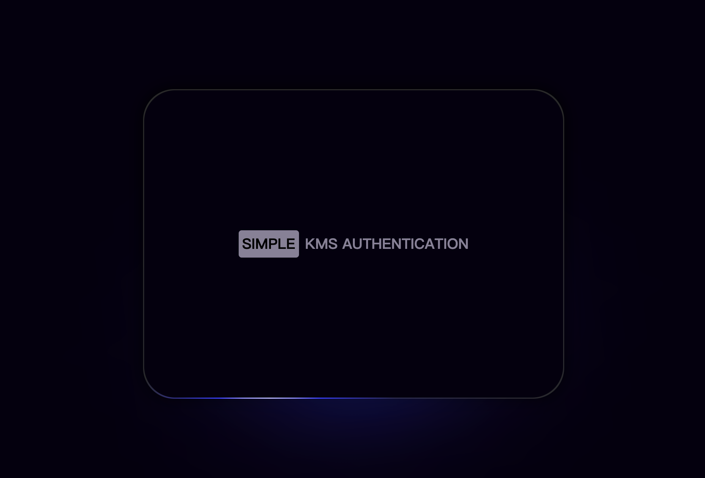

# Simple KMS



## API

- curl http://localhost:8090/config/data

```bash
ddeed7d2-ee42-5728-a06b-b70ee6f7d703
2023-03-08 23:17:27
```

- curl http://localhost:8090/config/seed

```bash
wmhOusGadDXJgncr
```

- curl http://localhost:8090/config/padding

```bash
dnkUpxfcKIRYHJuJ
```
